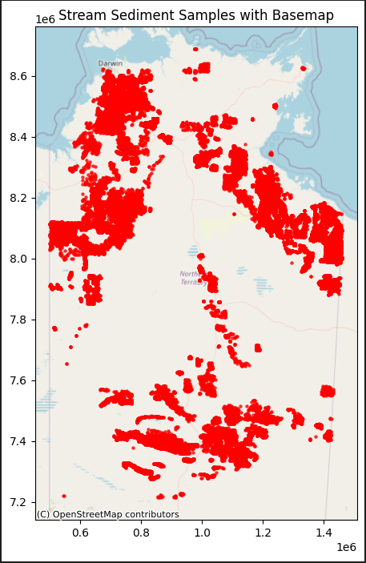
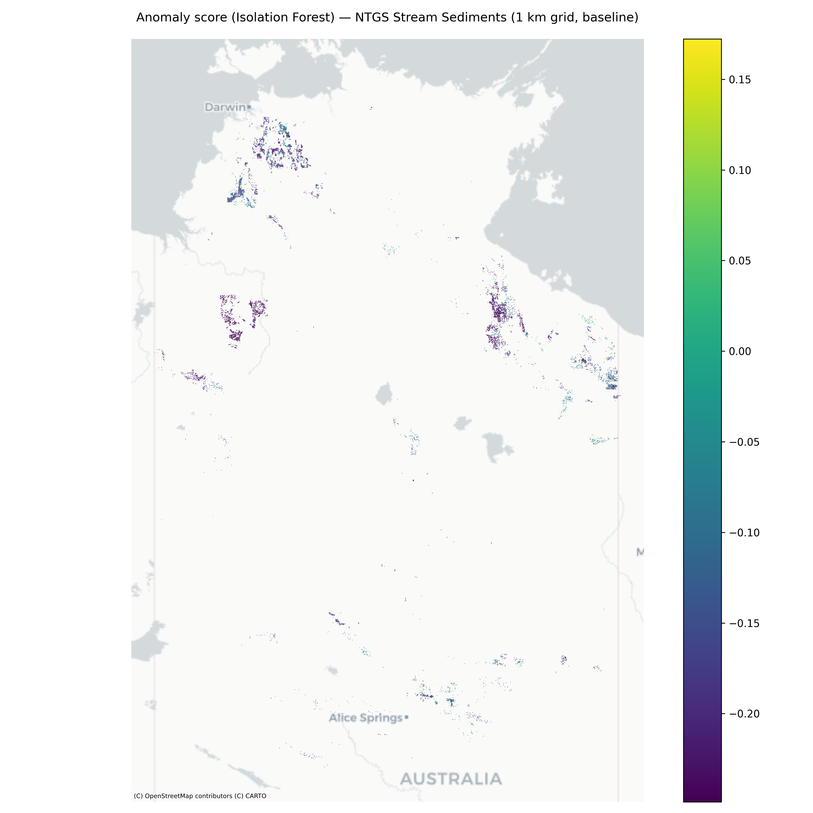
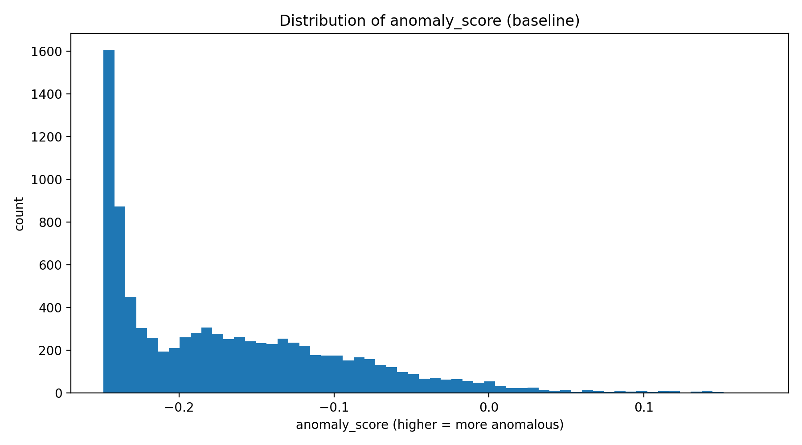
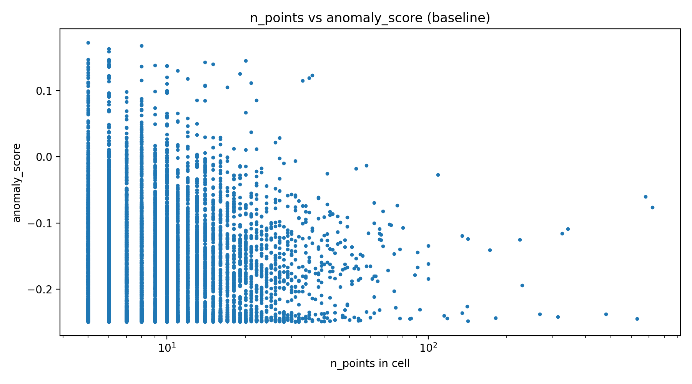
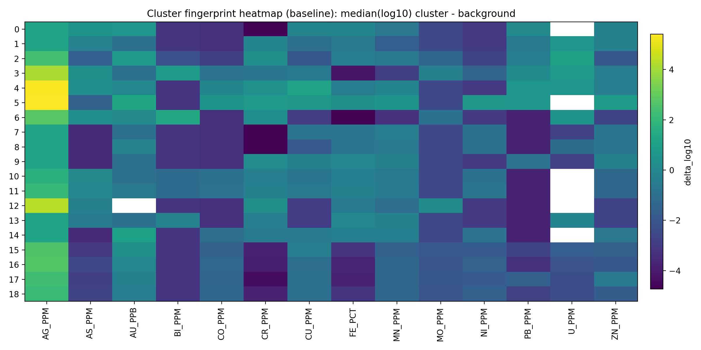

# NTGS Geochemical Anomaly Targeting (Unsupervised GIS + ML)

This repository implements an **end-to-end, unsupervised “target generation” workflow** for mineral exploration using **NTGS Stream Sediment geochemistry** (Northern Territory, Australia).

The core idea:

- **Input:** stream sediment geochemistry + coordinates (**no deposit labels required**)
- **Process:** aggregate to a regular grid → learn multivariate “background” → flag **multivariate geochemical anomalies** → spatially cluster anomalies into **exploration targets**
- **Output:** GIS-ready **GeoPackage layers** (grid anomaly map, anomaly clusters, target polygons + centroids) + **publication-style figures**

This is **Unsupervised Targeting** (a complete project without labels/covariates).  

<p align="center">
  
  <br>

</p>

## Dataset spatial distribution (Stream Sediment Samples with Basemap)

This map shows the **spatial footprint of my NTGS stream-sediment geochemistry dataset** (each red dot is one sample location) plotted on a basemap. The distribution is **highly non-uniform**—sampling density varies strongly across the Northern Territory—so it reflects **where surveys were conducted** rather than an even “blanket” coverage.

### 1) Clear spatial clustering (survey-driven coverage)
The samples form **distinct clusters** instead of a uniform scatter. This indicates the dataset is dominated by **campaign-style survey blocks** and **targeted exploration areas**, where sampling was intensified over specific geological provinces or tenements.

### 2) Major sampled regions visible on the map
From the pattern of dense point clouds, I can describe three broad “sampling provinces”:

- **Top End / Darwin–Kakadu–western Arnhem Land zone (north, near Darwin):**  
  A very dense cluster appears in the **north-western Top End**, close to the Darwin region and extending inland. This is consistent with strong coverage in accessible northern areas with active historical exploration and drainage networks.

- **North-east / Gulf–Arnhem / eastern Top End zone:**  
  A second dense belt appears toward the **north-eastern/eastern side** of the NT (toward the Gulf of Carpentaria side). The points often appear as **blocks and connected groups**, suggesting multiple survey programs across adjacent areas.

- **Central–southern NT (around the Alice Springs region):**  
  There is a large concentration in the **south/central-south** of NT (around the area labelled “Alice Springs”), including broad clusters and elongated patches. This looks like extensive sampling across central ranges/prospective corridors and surrounding catchments.

### 3) Linear and corridor-like patterns
Besides blobs/clusters, the map also shows **string-like or corridor patterns** (chains of points). These typically appear when sampling follows:
- drainage lines / catchment traverses,
- road-accessible transects,
- systematic survey grids conducted along campaign routes.

### 4) Sparse / under-sampled interior areas
Large parts of NT show **very low point density or gaps**. This likely corresponds to:
- limited drainage (fewer suitable stream sites in arid interiors),
- reduced accessibility/logistics,
- lower historical exploration intensity in some regions.

### 5) What this means for analysis / ML
This spatial pattern matters because it introduces **sampling bias**:
- “More samples” in an area does **not** automatically mean “more anomalous geology”—it often means **more survey effort**.
- Any model outputs (anomaly maps, targets) should be interpreted as **conditioned on survey coverage**.

That’s why my workflow used **grid aggregation (e.g., 1 km cells)** and later **min_points thresholds**—to reduce the dominance of very dense clusters and make results more comparable across regions with different sampling intensity.

### 6) Practical takeaway
Overall, this map confirms my dataset has **strong coverage in the Top End and central/southern NT**, with **distinct high-density survey blocks** and **gaps elsewhere**. The dataset is therefore well-suited for an **unsupervised targeting project** (anomaly detection + clustering), as long as I keep addressing the uneven sampling density (grid + stability/robustness checks).

---

## What we get 

### GIS artifacts (GeoPackage)
Produced in `artifacts/`:

**Baseline (full feature set):**
- `artifacts/baseline/ntgs_anomaly_grid_1km_stable_baseline.gpkg`
  - layer: `iforest_min5_baseline`
  - key fields: `anomaly_score` (higher = more anomalous), `is_anomaly`, `n_points`
- `artifacts/baseline/ntgs_anomaly_clusters_baseline.gpkg`
  - layer: `clusters_baseline_eps2km`
  - key fields: `cluster_id` (DBSCAN label for anomaly cells)
- `artifacts/baseline/ntgs_target_clusters_baseline.gpkg`
  - layer: `baseline_polygons` (target polygons)
  - layer: `baseline_centroids_wgs84` (target centroids with `lon`, `lat`)
- `artifacts/baseline/top_targets_baseline.csv`
- `artifacts/baseline/cluster_fingerprint_baseline.csv`

**Robustness (noAG feature ablation):**
- `artifacts/robustness_noAG/ntgs_anomaly_grid_1km_stable_noAG.gpkg`
  - layer: `iforest_min5_noAG`
- `artifacts/robustness_noAG/ntgs_anomaly_clusters_noAG.gpkg`
  - layer: `clusters_noAG_eps2km`
- `artifacts/robustness_noAG/ntgs_target_clusters_noAG.gpkg`
  - layer: `noAG_polygons`
  - layer: `noAG_centroids_wgs84`
- `artifacts/robustness_noAG/top_targets_noAG.csv`
- `artifacts/robustness_noAG/cluster_fingerprint_noAG.csv`


### Figures (PNG)
Produced in `figures/`:
- `fig1_anomaly_score_baseline.png` — anomaly score map (continuous)
- `fig2_target_clusters_baseline.png` — final target polygons + labels
- `fig3_robustness_overlay.png` — baseline vs noAG overlay
- `fig4_hist_anomaly_score_baseline.png` — anomaly score distribution
- `fig5_scatter_npoints_vs_score.png` — sampling density vs score
- `fig6_fingerprint_heatmap_baseline.png` — cluster geochemical “fingerprints”

---

## Dataset

**NTGS Geochemistry – Stream Sediment (Northern Territory)** (open data)

Contains:
- coordinates (`LONGITUDE`, `LATITUDE`, `geometry`)
- stream sediment geochemistry (many elements, e.g. `CU_PPM`, `AU_PPB`, ...)
- sample metadata (`SAMPLEID`, `SAMPLEREF`, `SAM_METH`, `MAP100K`, `MAP250K`, ...)

### Audit summary from run

The dataset is audited (before modeling) and observed:

- rows: **157,520**
- cols: **91**
- CRS: **EPSG:4283**
- coordinate range:
  - lon min/max: **129.00249 → 138.04748**
  - lat min/max: **-25.14141 → -11.83064**
- geochem columns found: **70**
- duplicates:
  - `UNIQ_ID` is **unique** (acts as a row identifier)
  - duplicated coordinates exist (**28,871** rows share the same lon/lat) — common in geochem due to re-assays, splits, panel assays, and reporting practices
- nearest-neighbor spacing in UTM (EPSG:32753):
  - median NN distance ≈ **454 m**

That NN spacing is why this pipeline uses **grid aggregation (1 km)** instead of modeling each point directly.

---

## Project objective (Option 1 — Unsupervised Targeting)

### What “targeting” means here
Instead of predicting “probability of deposit” (which needs labels), we produce:
1) a **continuous anomaly intensity map**, and  
2) a small set of **ranked target areas** (polygons + centroids) for follow-up work.

This is a practical exploration deliverable: **where should we look next, based on multivariate geochemical patterns**.

---

## Method overview (what the pipeline does)

### Step 0 — Feature selection
Many elements are extremely sparse in the raw NTGS table. We choose a stable subset.

**Baseline features (14):**
`CU_PPM, PB_PPM, ZN_PPM, AU_PPB, AS_PPM, MN_PPM, FE_PCT, CO_PPM, NI_PPM, AG_PPM, MO_PPM, U_PPM, CR_PPM, BI_PPM`

**Robustness features (noAG, 13):**
same but **without `AG_PPM`** to test sensitivity.

### Step 1 — Grid aggregation (1 km)
- reproject to **UTM EPSG:32753**
- assign each sample to a **1 km × 1 km** cell
- aggregate geochem per cell using **median** (robust to outliers)
- compute `n_points` per cell

It can be observed:
- cells with any data: **40,272**
- after stabilization (`min_points ≥ 5`): **9,067**

### Step 2 — Detection limits + log transform
Many columns include `<=0` values (e.g., `-0.1`) which cannot be log-transformed.

Per feature:
- replace `<=0` with **min_positive/2**
- apply `log10`

Missing values are imputed using the **median**.

### Step 3 — Isolation Forest anomaly scoring
Fit **Isolation Forest** on the transformed feature vectors.

- `anomaly_score` is oriented so that **higher = more anomalous**
- anomalies defined by `contamination = 0.03` (top ~3%)

Stable run reported (baseline, `min_points ≥ 5`):
- anomaly cells: **272**
- threshold: ~0 (numerical near-zero due to score distribution)

### Step 4 — DBSCAN to convert anomalies into targets
Spatially cluster anomaly cells using **DBSCAN** on cell centroids:

- `eps = 2000 m`, `min_samples = 3`

Baseline clustering summary reported:
- anomaly cells clustered: **91**
- number of clusters: **19**

For each cluster:
- union cell polygons (+ small buffer for clean shapes)
- compute `n_cells`, `mean_score`, `max_score`, `mean_points`
- define **priority_score**:
  - `priority_score = n_cells × mean_score`

### Step 5 — Fingerprint for interpretability
For each target cluster and element:
- `delta_log10 = median(log10(element))_cluster − median(log10(element))_background`

This produces the heatmap in `fig6`.

---


### Baseline (with AG)
- Grid:
  - data cells: **40,272**
  - stable cells (`min_points ≥ 5`): **9,067**
- Isolation Forest:
  - contamination: **0.03**
  - anomaly cells: **272**
- DBSCAN:
  - clusters: **19**
  - clustered anomaly cells: **91**

### Robustness (noAG)
- Isolation Forest:
  - anomaly cells: **272**
- DBSCAN:
  - clusters: **17**
  - clustered anomaly cells: **75**

Interpretation:
- Many targets persist even after removing AG → targeting is **not purely driven by one element**.

---

## Figures explained (the 6 key visuals)

### 1) `fig1_anomaly_score_baseline.png` — anomaly score map (continuous)
**What it shows:** every stable 1 km cell colored by `anomaly_score`.  
**How to read it:** brighter/higher values = more anomalous multi-element composition.

Use it for:
- regional screening (where anomalies concentrate)
- identifying belts/trends
- sanity-checking for “salt-and-pepper” noise

<p align="center">
  
  <br>
  <em>
    Figure 1. Continuous anomaly score map produced by the baseline geospatial ML model, 
    highlighting spatial variations in mineral prospectivity across the study area.
  </em>
</p>

### 2) `fig2_target_clusters_baseline.png` — final targets (polygons + labels)
**What it shows:** the practical exploration output:
- background anomaly grid (faint)
- target polygons colored by `priority_score`
- labels for top targets (cluster IDs)

Use it for:
- ranked decision-making (“top 5 targets”)
- exporting polygons to a GIS/work plan

<p align="center">
  
  <br>
  <em>
    Figure 2. Final target polygons derived from anomaly score clustering, 
    with target IDs and spatial extents used for prioritisation.
  </em>
</p>

### 3) `fig3_robustness_overlay.png` — robustness overlay (baseline vs noAG)
**What it shows:** sensitivity test:
- baseline polygons (fill)
- noAG polygons (outline)

Interpretation:
- strong overlap ⇒ targets are **robust**
- large shifts ⇒ targets may be **feature-sensitive**

<p align="center">
  
  <br>
  <em>
    Figure 3. Overlay comparison between the baseline model and the model trained without Ag (silver), 
    illustrating the spatial robustness and stability of anomaly patterns.
  </em>
</p>


### 4) `fig4_hist_anomaly_score_baseline.png` — score distribution
**What it shows:** histogram of `anomaly_score`.  
Use it to:
- confirm expected long-tail behavior
- justify contamination/threshold choices
- compare baseline vs robustness runs

<p align="center">
  
  <br>
  <em>
    Figure 4. Histogram of anomaly score distribution for the baseline model, 
    showing the separation between background and anomalous responses.
  </em>
</p>

### 5) `fig5_scatter_npoints_vs_score.png` — sampling density vs score
**What it shows:** relationship between sampling density and anomaly score.  
Use it to:
- ensure high anomalies aren’t *only* from very sparse cells
- justify the `min_points` filter (3 vs 5)
- spot if there’s any sampling bias effect

<p align="center">
  
  <br>
  <em>
    Figure 5. Relationship between sampling density (number of points) and anomaly score, 
    used to assess potential sampling bias effects.
  </em>
</p>

### 6) `fig6_fingerprint_heatmap_baseline.png` — target fingerprints
**What it shows:** enrichment/depletion signatures for each target cluster.

- **rows:** target clusters
- **columns:** elements/features
- **color value:** `delta_log10` (cluster median minus background median)

<p align="center">
  
  <br>
  <em>
    Figure 6. Geochemical fingerprint heatmap of final target clusters, 
    summarising multi-element signatures that characterise each anomaly cluster.
  </em>
</p>


---

## Repository layout

```
.
├── data/
│   ├── raw/                  # place ntgs_stream_sediments.gpkg here (not committed)
│   ├── interim/
│   └── processed/
├── artifacts/
│   ├── baseline/
│   └── robustness_noAG/
├── figures/
├── notebooks/
│   ├── 01_data_audit.ipynb
│   ├── 02_anomaly_model.ipynb
│   └── 03_visualize_maps.ipynb
├── scripts/
│   ├── 00_audit_dataset.py
│   ├── 10_build_grid.py
│   ├── 20_run_iforest_baseline.py
│   ├── 21_run_iforest_noAG.py
│   ├── 30_cluster_targets.py
│   ├── 40_fingerprint.py
│   └── 50_make_figures.py
├── src/
│   ├── config.py
│   ├── io.py
│   ├── grid.py
│   ├── preprocess.py
│   ├── modeling.py
│   ├── clustering.py
│   ├── fingerprint.py
│   └── viz.py
├── requirements.txt
└── environment.yml
```

---

## How to run

### 1) Put raw data in place


```
data/GEOCHEM_STREAM_SEDIMENTS.csv
```


### 2) Install dependencies

**Option A: pip**
```bash
pip install -r requirements.txt
```

**Option B: conda** (recommended for GeoPandas stack)
```bash
conda env create -f environment.yml
conda activate ntgs-anomaly
```

### 3) Run in notebooks (best for reviewers)
Run in order:
1. `notebooks/01_data_audit.ipynb`
2. `notebooks/02_anomaly_model.ipynb`
3. `notebooks/03_visualize_maps.ipynb`

### 4) Run as scripts (pipeline/reproducibility)
```bash
python scripts/10_build_grid.py
python scripts/20_run_iforest_baseline.py
python scripts/21_run_iforest_noAG.py
python scripts/30_cluster_targets.py
python scripts/40_fingerprint.py
python scripts/50_make_figures.py
```

---

## Key parameters (and why)

- **Grid size:** `1000 m`  
  Based on median NN distance (~454 m); grid reduces noise and unifies sampling density.
- **min_points:** `≥ 5`  
  Dataset has many sparse cells; filtering improves stability of targets.
- **Isolation Forest contamination:** `0.03`  
  Produces a manageable number of anomalies (~3%) for exploration targeting.
- **DBSCAN:** `eps = 2000 m`, `min_samples = 3`  
  Groups anomaly cells into coherent target areas rather than isolated pixels.
- **priority_score:** `n_cells × mean_score`  
  Simple and interpretable ranking: bigger + stronger anomalies are prioritized.

All parameters are centralized in `src/config.py`.

---

## Notes (geochem & GIS)

### Non-positive values (<= 0)
Values like `-0.1` often represent reporting conventions / detection limits.  
We replace them with `min_positive/2` per element to enable log transforms.

### Duplicate coordinates
Duplicated lon/lat rows are common and not automatically “bad”.  
This pipeline is robust to duplicates because it aggregates by **grid cell median**.

---

## Limitations
This is an **unsupervised targeting** project:
- it **does not** output “probability of deposit”
- validation typically uses additional layers (occurrences, geology, structure, geophysics) or follow-up sampling

---

## Next steps (Option 2 — Prospectivity mapping)
To upgrade into a supervised Mineral Prospectivity Mapping project, add:
- **labels:** known occurrences/deposits (positive), background/negative sampling strategy
- **covariates:** geology, faults, radiometrics, magnetics, gravity, DEM derivatives, etc.
- models such as Random Forest / XGBoost / CNN-on-rasters

